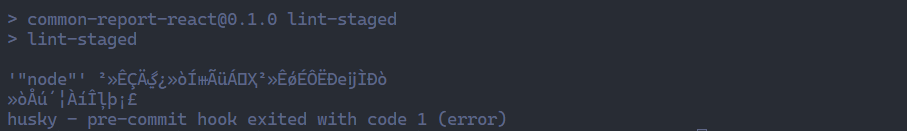

# 使用 husky + lint-staged + eslint + commintlint 实现自动化工程增量提交检测

## 项目现状

现项目使用 @ice/spec 库的 eslint 规则，虽然该库使用的是 eslint-config-airbnb 规则集非常著名，但是@ice/spec 有许多的默认规则，致使现在项目中的 eslint 不能满足日常开发过程中对代码质量的验证。

```javascript
module.exports = {
  root: true,
  parser: require.resolve('babel-eslint'),
  parserOptions: {
    ecmaVersion: 2018,
    ecmaFeatures: {
      jsx: true,
    },
  },
  extends: [
    /** Airbnb JavaScript Style Guide https://github.com/airbnb/javascript#types */
    // dep plugins: plugin-react, plugin-jsx-a11y
    // include rules: airbnb-base, custom react, custom react-a11y
    require.resolve('eslint-config-airbnb'),

    require.resolve('eslint-config-prettier'),
    require.resolve('eslint-config-prettier/react'),
  ],
  plugins: [
    'react-hooks',
  ],
  env: {
    es6: true,
    browser: true,
    node: true,
  },
  rules: {
    /** React Hooks Style Guide https://reactjs.org/docs/hooks-rules.html */
    'react-hooks/rules-of-hooks': 'error',
    'react-hooks/exhaustive-deps': 'warn',

    /** 无障碍相关 https://github.com/evcohen/eslint-plugin-jsx-a11y/tree/master/docs/rules */
    // label htmlFor 属性或者用 label 把表单组件包起来：警告
    'jsx-a11y/label-has-associated-control': 1,
    // 静态元素（div/span/...）不允许绑定事件，除非指定 role：取消
    'jsx-a11y/no-static-element-interactions': 0,
    // 静态元素（div/span/...）不允许绑定事件，除非指定 role：取消
    'jsx-a11y/no-noninteractive-element-interactions': 0,
    // 支持 click 事件必须同时支持键盘事件：取消
    'jsx-a11y/click-events-have-key-events': 0,
    // 禁止不规则使用 a 标签：取消
    'jsx-a11y/anchor-is-valid': 0,
    // require that JSX labels use "htmlFor": 警告
    'jsx-a11y/label-has-for': 1,

    /** react相关 https://github.com/yannickcr/eslint-plugin-react/tree/master/docs/rules */
    // index 不能作为 key：取消
    'react/no-array-index-key': 0,
    // 每行只能有一个jsx组件声明： 取消
    'react/jsx-one-expression-per-line': 0,
    // 必须声明 propTypes：取消
    'react/prop-types': 0,
    // 第一个props必须放在新的一行：取消 TBD
    'react/jsx-first-prop-new-line': 0,
    // 使用 props/state/context 必须解构：取消
    'react/destructuring-assignment': 0,
    // 禁止不具体的 propTypes 声明：取消
    'react/forbid-prop-types': 0,
    'react/jsx-filename-extension': [
      1,
      {
        'extensions': ['.js', '.jsx'],
      },
    ],
    // 允许使用 React.Fragment
    'react/jsx-fragments': 0,
    // ...props
    'react/jsx-props-no-spreading': 0,

    // 不允许使用 dangerous 属性：取消
    'react/no-danger': 0,

    /** import/export相关 https://github.com/benmosher/eslint-plugin-import/tree/master/docs/rules */
    // 必须写明文件类型：取消
    'import/extensions': 0,
    // 路径必须可以被本地文件系统解析：取消
    'import/no-unresolved': 0,
    // 只能引用package.json声明的依赖：取消 TBD
    'import/no-extraneous-dependencies': 0,
    // 优先使用 export default: 取消
    'import/prefer-default-export': 0,

    /** 基础语法规则 https://eslint.org/docs/rules/ */
    // 禁止 console.log：取消
    'no-console': 0,
    // 禁止变量声明与外层作用域的变量同名：警告
    'no-shadow': 1,
    // 禁止未使用过的表达式：警告
    'no-unused-expressions': 1,
    // 禁止变量定义前使用：警告, 函数除外
    'no-use-before-define': ['warn', { 'functions': false }],
    // 禁止直接调用 Object.prototypes 的内置属性：警告
    'no-prototype-builtins': 1,
    // 禁止匿名函数：取消
    'func-names': 0,
    // 箭头函数必须使用大括号：取消
    'arrow-body-style': 0,
    // 优先使用解构：取消
    'prefer-destructuring': 0,
    // 禁止对函数参数进行重新赋值：警告
    'no-param-reassign': 1,
    // 函数必须有返回值：取消 TBD
    'consistent-return': 0,
    // 对象声明是否换行：取消
    'object-curly-newline': 0,
    // 禁用特定的全局变量：取消
    'no-restricted-globals': 0,
    // 禁止 if 语句中 return 语句之后有 else 块：取消
    'no-else-return': 0,
    // 禁止在 return 语句中使用赋值语句：取消 TBD  ref={formRef => form = formRef}
    'no-return-assign': 0,
    // 禁止在return语句中使用await：取消
    'no-return-await': 0,
    // 禁止 ++ --: 取消
    'no-plusplus': 0,

    // 分号结尾：不要求
    'semi': 0,
    // 结尾逗号：不要求
    'comma-dangle': 0,
    // 声明未使用：warning
    'no-unused-vars': 1,
    // 缩进：强制两空格
    'indent': ['error', 2, { 'SwitchCase': 1, 'flatTernaryExpressions': true, }],
    // 强制一行的最大长度：不限制
    'max-len': 0,
    'quotes': ['error', 'single'],
  },
};
```

如以下常见问题：


## 目标

* 研发团队公用一套静态代码检测规范。
* 一套代码提交规范。
* 利用自动化工具完成检测，提高编码规范性和review效率。

## 解决方案

* eslint：使用 @iceworks/spec 库的eslint 规则，该库的规则集 [eslint-config-ali](https://www.npmjs.com/package/eslint-config-ali) 参考或引用了许多优秀的业界开源规范、标准化文档和技术官网，足以满足日常开发过程中对代码质量的验证。
* Husky：git 客户端增加 hook 的工具，本次工程化中主要实现 commit 前的 eslint 自动修复功能与获取 commit 信息。
* lint-staged： 一个仅仅过滤出 Git 代码暂存区文件(被 git add 的文件)的工具；这个很实用，因为我们如果对整个项目的代码做一个检查，可能耗时很长，如果是老项目，要对之前的代码做一个代码规范检查并修改的话，这可能就麻烦了，可能导致项目改动很大。
* commintlint：对 git commit 的信息进行限制的工具。

直接增加eslint校验，由于项目多而杂，并且一些老页面已经很久没有更新过了，建议如下：从今往后，新增的页面增加 eslint 检查，老页面先忽略使用。

## eslint 相关改动

### 替换 .eslintrc.js 文件内容

```javascript
const { getESLintConfig } = require('@iceworks/spec');

module.exports = getESLintConfig('react', {
  rules: {
    '@iceworks/best-practices/no-js-in-ts-project': 0, // 由于此项目是ts项目，但大量使用了jsx，故关闭此校验
  },
});
```

### 在 .eslintignore 文件中添加旧页面的忽略

使用 node 的 fs 及 path 库，遍历 src 文件夹下的所有 js|ts|jsx|tsx 文件，将其路径输出在控制台，统一复制到 .eslintignore 文件中。注意控制台输出的文件路径使用的是 \ ，需要统一使用 / 替换。

```javascript
function walkSync(currentDirPath, callback) {
  const fs = require('fs');
  const path = require('path');

  fs.readdirSync(currentDirPath, { withFileTypes: true }).forEach((dirent) => {
    const filePath = path.join(currentDirPath, dirent.name);
    if (dirent.isFile()) {
      if (dirent.name.match(/\.(js|ts|jsx|tsx)$/)) {
        callback(filePath, dirent);
      }
    } else if (dirent.isDirectory()) {
      walkSync(filePath, callback);
    }
  });
}
walkSync('src', (filePath, stat) => {
  console.log(filePath);
});
```

最后 .eslintignore 文件内容：

```shell
# 忽略目录
build/
tests/
demo/

# node 覆盖率文件
coverage/

# 忽略文件
**/*-min.js
**/*.min.js

# 忽略旧页面
src/app.jsx
src/components/common/barChart/index.jsx
src/components/common/chooseTime/index.jsx
src/components/common/CustomStyleSelect/index.jsx
src/components/common/downloadBtn/index.jsx
src/components/common/Echarts/index.jsx
src/components/common/lineChart/index.jsx
src/components/common/LzBlock/index.jsx
src/components/common/LzMsg/index.jsx
src/components/common/LzPagination/index.jsx
src/components/common/OptionsForTable/index.tsx
src/components/common/PageTip/index.jsx
src/components/common/pieChart/index.jsx
src/components/common/radarChart/index.jsx
src/components/common/ResponsiveContent/index.jsx
src/components/common/showLabelCard/index.jsx
src/components/common/subTitle/index.jsx
src/components/common/subTitleSecond/index.jsx
src/components/common/TableState/index.jsx
src/components/common/timeChoose/index.jsx
src/components/common/timeChooseThree/index.jsx
src/components/common/timeChooseTwo/index.jsx
src/components/common/topTitle/index.jsx
src/components/NotFound/index.tsx
src/components/PageTitle/index.tsx
src/components/section/activityOverView/index.jsx
src/components/section/activityResultAnalysis/index.jsx
src/components/section/funnelAndgraphChart/index.jsx
src/components/section/labelChooseShow/index.jsx
src/components/section/labelChooseShowForAnalysis/index.jsx
src/components/section/labelChooseShowForCustomerBusiness/index.jsx
src/components/section/labelChooseShowForMember/index.jsx
src/components/section/lineChartForAnalysis/index.jsx
src/components/section/pieChartForAnalysis/index.jsx
src/components/section/reportChooseCard/index.jsx
src/components/section/showLabelCardForAnalysis/index.jsx
src/components/section/timeChooseForAnalysis/index.jsx
src/components/section/timeChooseForCustomerAnalysis/index.jsx
src/components/section/timeChooseForOrderAdd/index.jsx
src/components/section/timeChooseForStrategy/index.jsx
src/components/section/vipTransAnalysis/index.jsx
src/components/section/vipTransTrend/index.jsx
src/components/UI/BtnWithPic/index.jsx
src/components/UI/InfoDialog/index.jsx
src/config.js
src/hooks/loreal/useGetShops.js
src/layouts/BasicLayout/index.tsx
src/layouts/LzPage/index.jsx
src/pages/Haier/BrandReport/index.jsx
src/pages/Haier/components/CreateJobDialog/index.jsx
src/pages/Haier/DataOverview/components/BlockItem/index.jsx
src/pages/Haier/DataOverview/components/secondaryTitle/index.jsx
src/pages/Haier/DataOverview/index.jsx
src/pages/Haier/InsightAnalysis/index.jsx
src/pages/Haier/InsightAnalysis/InsightAnalysisDetail/BaseDetail/index.jsx
src/pages/Haier/InsightAnalysis/InsightAnalysisDetail/CalculationUnusual/index.jsx
src/pages/Haier/InsightAnalysis/InsightAnalysisDetail/index.jsx
src/pages/Haier/InsightAnalysis/InsightAnalysisDetail/ReBuyInterval/components/BaseChart/index.jsx
src/pages/Haier/InsightAnalysis/InsightAnalysisDetail/ReBuyInterval/index.jsx
src/pages/Haier/InsightAnalysis/InsightAnalysisDetail/RFanalysis/components/ChangeF/index.jsx
src/pages/Haier/InsightAnalysis/InsightAnalysisDetail/RFanalysis/components/ChangeR/index.jsx
src/pages/Haier/InsightAnalysis/InsightAnalysisDetail/RFanalysis/components/CreateCrowdDialog/index.jsx
src/pages/Haier/InsightAnalysis/InsightAnalysisDetail/RFanalysis/components/TabBlock/index.jsx
src/pages/Haier/InsightAnalysis/InsightAnalysisDetail/RFanalysis/index.jsx
src/pages/Haier/InsightAnalysis/InsightAnalysisDetail/RFManalysis/Components/AddBaseLineValueDialog/index.jsx
src/pages/Haier/InsightAnalysis/InsightAnalysisDetail/RFManalysis/Components/CreateCrowdDialog/index.jsx
src/pages/Haier/InsightAnalysis/InsightAnalysisDetail/RFManalysis/index.jsx
src/pages/Haier/InsightAnalysis/InsightAnalysisDetail/RManalysis/components/ChangeM/index.jsx
src/pages/Haier/InsightAnalysis/InsightAnalysisDetail/RManalysis/components/ChangeR/index.jsx
src/pages/Haier/InsightAnalysis/InsightAnalysisDetail/RManalysis/components/CreateCrowdDialog/index.jsx
src/pages/Haier/InsightAnalysis/InsightAnalysisDetail/RManalysis/components/TabBlock/index.jsx
src/pages/Haier/InsightAnalysis/InsightAnalysisDetail/RManalysis/index.jsx
src/pages/Haier/InsightAnalysis/InsightAnalysisDetail/SingleDimension/BuyAmountChart/Components/BarChart/index.jsx
src/pages/Haier/InsightAnalysis/InsightAnalysisDetail/SingleDimension/BuyAmountChart/Components/CreateCrowdDialog/index.jsx
src/pages/Haier/InsightAnalysis/InsightAnalysisDetail/SingleDimension/BuyAmountChart/Components/EditSpreadsDialog/index.jsx
src/pages/Haier/InsightAnalysis/InsightAnalysisDetail/SingleDimension/BuyAmountChart/index.jsx
src/pages/Haier/InsightAnalysis/InsightAnalysisDetail/SingleDimension/BuyDurationChart/Components/BarChart/index.jsx
src/pages/Haier/InsightAnalysis/InsightAnalysisDetail/SingleDimension/BuyDurationChart/Components/CreateCrowdDialog/index.jsx
src/pages/Haier/InsightAnalysis/InsightAnalysisDetail/SingleDimension/BuyDurationChart/Components/EditSpreadsDialog/index.jsx
src/pages/Haier/InsightAnalysis/InsightAnalysisDetail/SingleDimension/BuyDurationChart/index.jsx
src/pages/Haier/InsightAnalysis/InsightAnalysisDetail/SingleDimension/Components/CalculationUnusual/index.jsx
src/pages/Haier/InsightAnalysis/InsightAnalysisDetail/SingleDimension/index.jsx
src/pages/Haier/InsightAnalysis/InsightAnalysisDetail/SingleDimension/RecentBuyChart/Components/BarChart/index.jsx
src/pages/Haier/InsightAnalysis/InsightAnalysisDetail/SingleDimension/RecentBuyChart/Components/CreateCrowdDialog/index.jsx
src/pages/Haier/InsightAnalysis/InsightAnalysisDetail/SingleDimension/RecentBuyChart/Components/EditSpreadsDialog/index.jsx
src/pages/Haier/InsightAnalysis/InsightAnalysisDetail/SingleDimension/RecentBuyChart/index.jsx
src/pages/Haier/InsightAnalysis/NewAnalysis/components/Create/index.jsx
src/pages/Haier/InsightAnalysis/NewAnalysis/index.jsx
src/pages/Haier/MemberArbitrageBenefitReport/index.jsx
src/pages/Haier/MemberArbitrageProductTopReport/index.jsx
src/pages/Haier/MemberArbitrageProductTopReport/MoneyRange/index.jsx
src/pages/Haier/MemberBigArbitrageReport/index.jsx
src/pages/Haier/MemberBigArbitrageReport/MoneyRange/index.jsx
src/pages/Haier/MemberPointDistribution/components/EditSpreadsDialog/index.jsx
src/pages/Haier/MemberPointDistribution/index.jsx
src/pages/Haier/MemberSalesReport/index.jsx
src/pages/Haier/MemberSingleProductRightsReport/index.jsx
src/pages/Haier/RecruitmentChannelsReport/index.jsx
src/pages/Home/index.jsx
src/pages/Yili/InsightAnalysis/index.jsx
src/pages/Yili/InsightAnalysis/InsightAnalysisDetail/BaseDetail/index.jsx
src/pages/Yili/InsightAnalysis/InsightAnalysisDetail/CalculationUnusual/index.jsx
src/pages/Yili/InsightAnalysis/InsightAnalysisDetail/index.jsx
src/pages/Yili/InsightAnalysis/InsightAnalysisDetail/RepurchaseAnalysis/index.jsx
src/pages/Yili/InsightAnalysis/InsightAnalysisDetail/RFanalysis/components/ChangeF/index.jsx
src/pages/Yili/InsightAnalysis/InsightAnalysisDetail/RFanalysis/components/ChangeR/index.jsx
src/pages/Yili/InsightAnalysis/InsightAnalysisDetail/RFanalysis/components/CreateCrowdDialog/index.jsx
src/pages/Yili/InsightAnalysis/InsightAnalysisDetail/RFanalysis/components/TabBlock/index.jsx
src/pages/Yili/InsightAnalysis/InsightAnalysisDetail/RFanalysis/index.jsx
src/pages/Yili/InsightAnalysis/InsightAnalysisDetail/SingleDimension/BuyAmountChart/Components/BarChart/index.jsx
src/pages/Yili/InsightAnalysis/InsightAnalysisDetail/SingleDimension/BuyAmountChart/Components/CreateCrowdDialog/index.jsx
src/pages/Yili/InsightAnalysis/InsightAnalysisDetail/SingleDimension/BuyAmountChart/Components/EditSpreadsDialog/index.jsx
src/pages/Yili/InsightAnalysis/InsightAnalysisDetail/SingleDimension/BuyAmountChart/index.jsx
src/pages/Yili/InsightAnalysis/InsightAnalysisDetail/SingleDimension/BuyDurationChart/Components/BarChart/index.jsx
src/pages/Yili/InsightAnalysis/InsightAnalysisDetail/SingleDimension/BuyDurationChart/Components/CreateCrowdDialog/index.jsx
src/pages/Yili/InsightAnalysis/InsightAnalysisDetail/SingleDimension/BuyDurationChart/Components/EditSpreadsDialog/index.jsx
src/pages/Yili/InsightAnalysis/InsightAnalysisDetail/SingleDimension/BuyDurationChart/index.jsx
src/pages/Yili/InsightAnalysis/InsightAnalysisDetail/SingleDimension/Components/CalculationUnusual/index.jsx
src/pages/Yili/InsightAnalysis/InsightAnalysisDetail/SingleDimension/index.jsx
src/pages/Yili/InsightAnalysis/InsightAnalysisDetail/SingleDimension/RecentBuyChart/Components/BarChart/index.jsx
src/pages/Yili/InsightAnalysis/InsightAnalysisDetail/SingleDimension/RecentBuyChart/Components/CreateCrowdDialog/index.jsx
src/pages/Yili/InsightAnalysis/InsightAnalysisDetail/SingleDimension/RecentBuyChart/Components/EditSpreadsDialog/index.jsx
src/pages/Yili/InsightAnalysis/InsightAnalysisDetail/SingleDimension/RecentBuyChart/index.jsx
src/pages/Yili/InsightAnalysis/NewAnalysis/components/Create/index.jsx
src/pages/Yili/InsightAnalysis/NewAnalysis/index.jsx
src/routes.js
src/service/factory.js
src/service/haier.api.js
src/service/index.js
src/service/requestConfig.js
src/service/yili.api.js
src/typings.d.ts
src/utils/constant.js
src/utils/index.js
src/utils/momentUtil.js
```

## Husky 新增

安装 Husky

```shell
npm install husky --save-dev
```

package.json scripts 中新增 "prepare": "husky install"，使得其他项目开发人员 npm install 时生成 .husky 文件夹，可以直接应用已有的 git 钩子。

```json
{
  "scripts": {
    "prepare": "husky install"
  }
}
```

生成 pre-commit 钩子文件

```shell
npx husky add .husky/pre-commit 'npm run lint-staged';
```

这时生成如下文件：


这里使用了 lint-staged，接下来需要安装它。

## 配置 lint-staged

安装 lint-staged

```shell
npm install lint-staged --save-dev 
```

package.json 中新增如下内容：

```json
{
  "scripts": {
    "lint-staged": "lint-staged",
  },
  "lint-staged": {
    "*.{js,ts,jsx,tsx}": [
      "eslint --cache --fix",
      "git add"
    ]
  }
}
```

## 配置 commintlint

生成 pre-commit 钩子文件

```shell
npx husky add .husky/commit-msg 'npx commitlint --edit "$1"'
// 如果不生效请使用yarn
yarn husky add .husky/commit-msg 'yarn commitlint --edit "$1"'
```

增加 commintlint 配置，根目录新建 commitlint.config.js 文件，配置如下：

```javascript
module.exports = {
  extends: ['@commitlint/config-conventional'],
  rules: {
    'body-leading-blank': [2, 'always'],
    'footer-leading-blank': [1, 'always'],
    'header-max-length': [2, 'always', 108],
    'subject-empty': [2, 'never'],
    'type-empty': [2, 'never'],
    'type-enum': [
      2, // type必须输入
      'always',
      [
        'feat', // 新功能
        'fix', // 修复bug
        'style', // 修改格式，删除代码空格、缩进等
        'docs', // 文档、注释修改
        'refactor', // 代码重构，没有功能修改
        'merge', // 代码合并
        'revert', // 版本回滚
        'chore', // 构建过程或辅助工具的变动
        'test',
        'perf',
        'build',
        'ci',
        'revert',
        'wip',
        'workflow',
        'types',
        'release',
      ],
    ],
  },
};
```

## ide 支持

### VSCode

安装 eslint 插件


打开设置，搜索 eslint format， 开启使用 eslint 格式化文档。


开发中出现 eslint 错误，在页面中右击选择 使用...格式化文档，选择 Eslint，可修复页面中大多数 eslint 错误。


也可将 Eslint 格式化设置为默认值，在配合快捷键 Shift + Alt + F，快速修复。

### WebStorm

由于 Webstorm 自带 eslint 插件，只需开启自动 ESlint 设置即可。


## 提交流程

我们从头理一下工具的工作模式：当我们进行一次git提交时 => 触发husky配置的pre-commit钩子 => 执行npm run lint-staged命令 => 触发lint-staged对暂存区的文件进行格式化（使用package.json中配置的lint-staged任务） => 使用 eslint 进行格式化，如果通过了 eslint 检测 => 触发husky配置的 commit-msg 钩子，对 commit 信息进行检查，通过检测可以 push。

### 没有通过 eslint 的示例：


需要根据 error 信息修复，error 必须修复， warning 建议修复。如遇暂时无法修复的问题可使用 ide 功能快速修复功能忽略当前错误：


### 没有通过 commitlint 的示例：

错误的示例：git commit -m 'xxx'


正确的格式 git commit -m 'type: subject'
其中 type 和 subject 为必填项，type 的可选值如下：

```javascript
const type = [
  'feat', // 新功能
  'fix', // 修复bug
  'style', // 修改格式，删除代码空格、缩进等
  'docs', // 文档、注释修改
  'refactor', // 代码重构，没有功能修改
  'merge', // 代码合并
  'revert', // 版本回滚
  'chore', // 构建过程或辅助工具的变动
  'test',
  'perf',
  'build',
  'ci',
  'revert',
  'wip',
  'workflow',
  'types',
  'release',
];
```

subject 任意，: 为英文半角符号，后跟空格。

## 可能遇到的问题

由于某些未知原因导致在 husky 钩子中使用 npm 命令，会出现乱码的情况：



使用 chcp 65001 转码执行 lint-staged 命令出现非乱码错误。


但是在正常情况下npm run eslint 就没问题 然后在git hook中运行npm run eslint 就报错。
最后解决方法是将 node环境系统变量调至第一位在重启ide解决。


